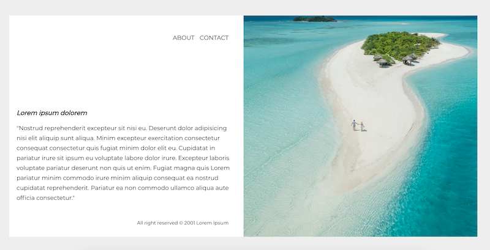

# My travel website
You will create a simple travel-agency page with a text and an image

### Topics
HTML: HTML5 Semantic Elements  
CSS: position, background, font, clearfix

**You need to**

- use Google Fonts
- set the image to background (the image should not be in the html)
- use float not flex

### Design

Design

Font: Montserrat from Google Fonts
