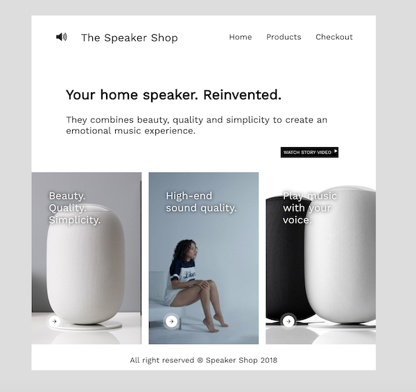

# My first shop design
You will create a simple online shop page with 3 products

### Topics
HTML: HTML5 Semantic Elements  
CSS: box-sizing, background-image, background-size, background-position

### Design




### Extras

- Create and link more pages
- Use branches in your repository
- Publish the page using github page and gh-pages branch

### Bonus
The background images are in 
```
assets/images
```

Font: Work Sans from Google Fonts

